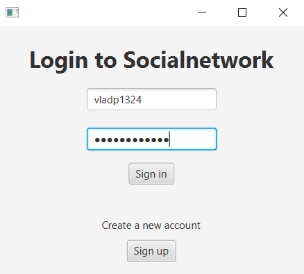
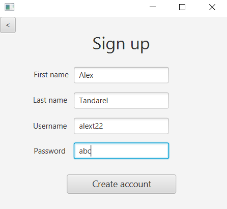
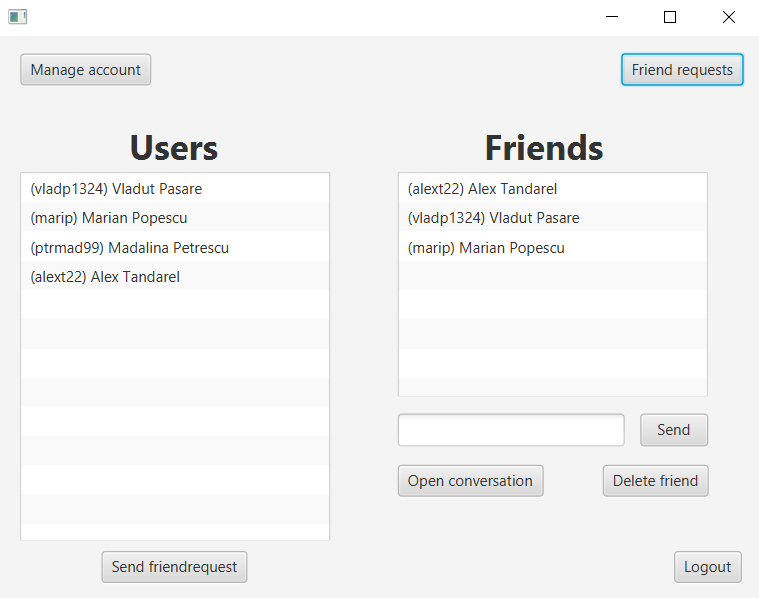
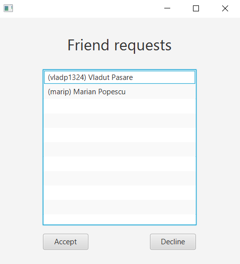
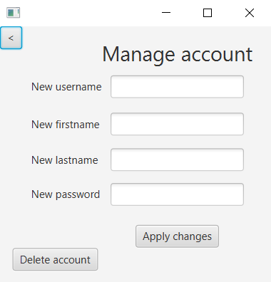

# Social-Network Project

## Description
Social-Network is a Java-based application designed to mimic the functionalities of a typical social networking platform. Developed using IntelliJ, this project includes features such as user authentication, account management, friend management, messaging, and more.

## Features
- **Login and Signup:** Users can create new accounts or login with existing credentials securely.
- **Account Management:** Users can manage their accounts by updating personal information such as username, first name, last name, and also have the option to delete their accounts.
- **Friend Management:** Users can add, delete, and message friends.
- **Friend Requests:** Users can send, accept, or decline friend requests.

## Screenshots
*Login Page*

*Signup Page*

*Main Page*

*Friend Requests Page*

*Manage Account Page*

